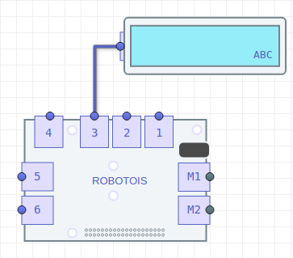

# Primeros Pasos con el Display LCD

El módulo de Display LCD consiste en una combinación de un módulo de comunicación y control del LCD, y el LCD como tal. Un ejemplo del LCD es el que se muestra en el siguiente [link](https://cdn-shop.adafruit.com/970x728/181-02.jpg). Este Display cuenta un área de 16x2 caracteres, es decir, que se tienen dos renglones con 16 caracteres cada uno.

Este módulo puede ser muy útil para mostrar mensajes que indiquen alguna información relevante en algún proyecto o práctica, o también podría servir para mostrar mensajes de alarma.

El módulo del Display LCD se comunica con el Shield a través del puerto IIC, por lo que en esta librería no es necesario especificar el conector. No obstante en la plataforma Robotois sí es necesario especificar el puerto, ello debido a que se considera que la plataforma está orientada a un nivel de principiante.

## Instalación de la librería

Para instalar esta librería se puede usar el gestor **npm** para obtener la versión estable, o la herramienta **git** para obtener la última versión del repositorio en [GitHub](https://github.com/Robotois/robotois-lcd-display).

Usando **npm** se ejecuta la siguiente línea en la terminal:

```bash
npm install robotois-lcd-display
```

Con la herramienta **git** se debe clonar el repositorio:

```bash
git clone https://github.com/Robotois/robotois-lcd-display.git
```
En este caso, es necesario instalar las dependencias de la librería de manera manual. Por lo que, en el directorio donde se descargó el repositorio (`cd robotois-lcd-display`) se ejecuta lo siguiente:

```bash
npm install
```

## Inicialización


Una vez que el módulo del Display LCD está conectado en uno de los puertos genéricos (`1-6`), la inicialización se realiza de la siguiente manera:

```javascript
const LCD = require('robotois-lcd-display');
const lcd = new LCD();
```


## Mostrar mensajes

### Función `setText()`
Un ejemplo práctico de cómo mostrar mensajes en el Display LCD es el siguiente:

```javascript
const LCD = require('robotois-lcd-display');
const lcd = new LCD();

lcd.setText("Hola mundo!!");

console.log("El mensaje se mostrará por 5 segundos!!");
setTimeout(() => {
  lcd.release();
  console.log("Bye!!");
},5000);
```
En este caso, la función `setText()` se utiliza para mostrar un mensaje estático, ya que éste no cambia durante la ejecución del código. Como se observa, la función `release()` se llama antes de terminar la ejecución del código. Esto se realiza para liberar adecuadamente el Display LCD, ya que se limpia el Display y se apaga la luz de fondo.

No obstante, cuando se tiene un proceso que se ejecuta de manera contínua, y éste termina su ejecución a través de una señal de salida, como `SIGINT` o `SIGTERM`, la librería cuenta con el mecanismo de liberación del Display sin necesidad de llamar la función `release()` de manere explícita.
